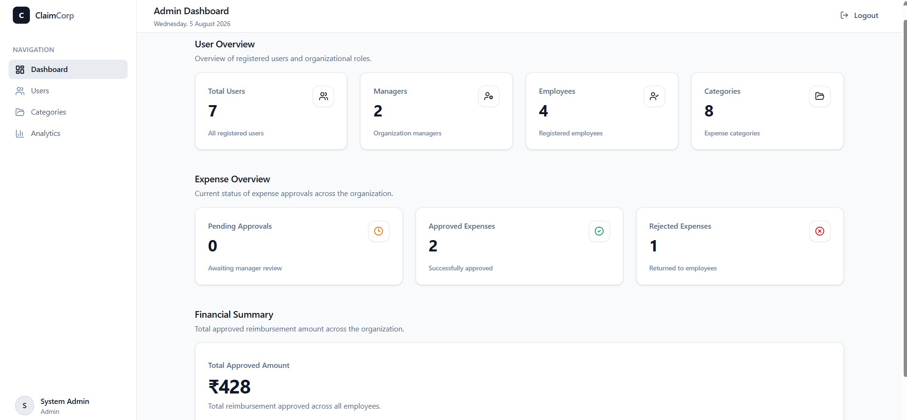
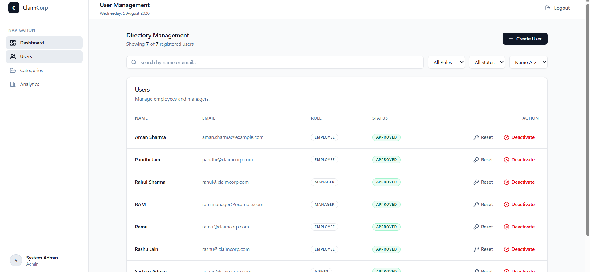
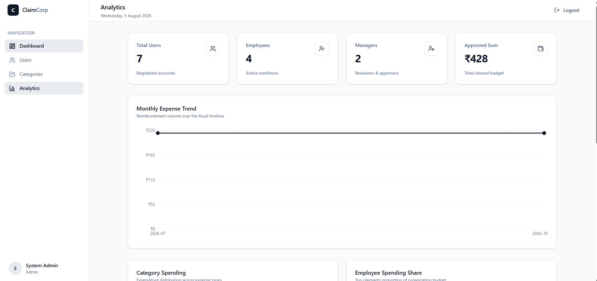
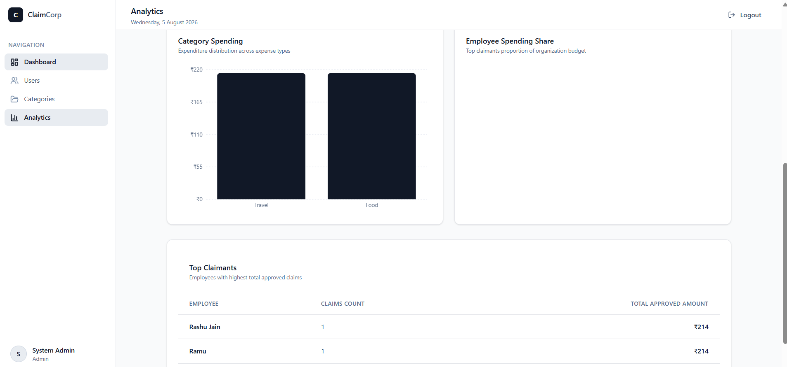
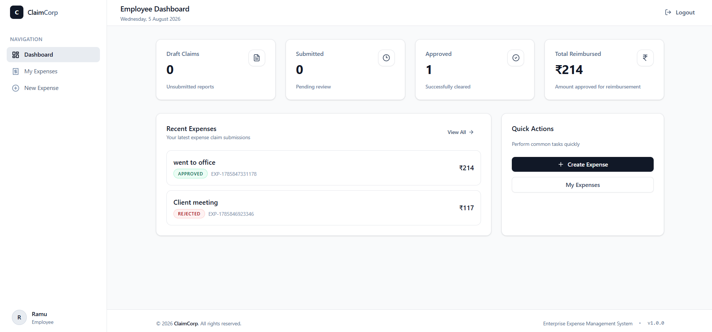
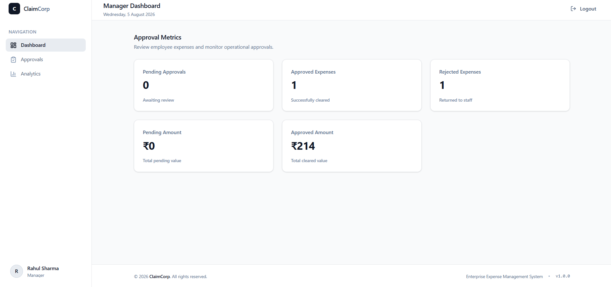

# 💼 ClaimCorp – Enterprise Expense Management System

<p align="center">
  <strong>A modern full-stack enterprise expense management platform built with React, Node.js, Express, Prisma, and PostgreSQL.</strong>
</p>
---
## 🚀 Live Application

🌐 **Frontend:** https://claim-corp.vercel.app

📦 **Backend API:** https://caimcorp-backend.onrender.com

💻 **Repository:** https://github.com/paridhijain153/ClaimCorp
---
<p align="center">


</p>

---

## 📖 Overview

ClaimCorp is a **role-based Enterprise Expense Management System** designed to streamline employee reimbursement workflows within organizations.

The platform enables employees to submit expense claims, managers to review and approve requests, and administrators to manage users, categories, and organization-wide analytics through a modern dashboard.

The project follows a clean layered architecture with separate frontend and backend applications.

---

# ✨ Features

## 👤 Authentication

- Secure JWT Authentication
- Role-Based Access Control (RBAC)
- Protected Routes
- Admin Password Reset
- Secure Password Hashing (bcrypt)

---

## 👨‍💼 Admin

- Interactive Dashboard
- User Management
- Create Employees & Managers
- Activate / Deactivate Users
- Reset User Passwords
- Category Management
- Activate / Deactivate Categories
- Enterprise Analytics Dashboard
- Search, Filter & Sort Users

---

## 👨‍💻 Manager

- Dashboard Overview
- Review Submitted Expenses
- Approve / Reject Claims
- Expense Analytics
- Employee Spending Insights

---

## 👨‍💼 Employee

- Personal Dashboard
- Create Expense Claims
- Edit Draft Expenses
- Submit Claims
- View Expense History
- OCR Autofill Support
- Reimbursement Summary

---

## 📊 Analytics

- Monthly Expense Trends
- Category Spending
- Employee Spending
- Organization Statistics
- Financial Summary

---

## 🎨 UI Highlights

- Modern Enterprise Dashboard
- Responsive Layout
- Reusable Components
- Professional Data Tables
- Search & Filters
- Consistent Design System
- Toast Notifications
- Dashboard Cards
- Responsive Sidebar
- Clean Typography

---

# 🛠 Tech Stack

## Frontend

- React
- Vite
- Tailwind CSS
- React Router
- Axios
- Recharts
- Lucide React
- React Hot Toast

## Backend

- Node.js
- Express.js
- Prisma ORM
- PostgreSQL
- JWT Authentication
- Zod Validation
- Multer
- bcrypt

---

# 📁 Project Structure

```text
ClaimCorp
│
├── frontend/
│   ├── src/
│   ├── public/
│   └── README.md
│
├── backend/
│   ├── prisma/
│   ├── src/
│   └── README.md
│
├── screenshots/
│
└── README.md
```

---

# 🚀 Getting Started

Clone the repository

```bash
git clone https://github.com/your-username/ClaimCorp.git
```

Move into the project

```bash
cd ClaimCorp
```

---

## Backend

```bash
cd backend
npm install
```

Create a `.env` file and configure your environment variables.

Run Prisma migrations

```bash
npx prisma migrate dev
```

Seed the database

```bash
npm run seed
```

Start the backend

```bash
npm run dev
```

---

## Frontend

```bash
cd frontend
npm install
npm run dev
```

---

# 📸 Screenshots

## Admin Dashboard



---

## User Management



---

## Analytics Dashboard




---

## Employee Dashboard



---

## Manager Dashboard



---

# 🏗 Architecture

```
React Frontend
        │
Axios REST API
        │
Express Server
        │
Controllers
        │
Services
        │
Repositories
        │
Prisma ORM
        │
PostgreSQL
```

---

# 🔒 Security

- JWT Authentication
- Password Hashing using bcrypt
- Role-Based Authorization
- Request Validation using Zod
- Protected API Endpoints
- Secure Environment Variables

---

# 📚 Documentation

Additional documentation is available inside:

- 📄 `frontend/README.md`
- 📄 `backend/README.md`

---

# 🔮 Future Improvements

- Email Notifications
- Forgot Password via Email
- Receipt OCR Enhancements
- Export Reports (PDF / Excel)
- Audit Logs
- Docker Support
- CI/CD Pipeline
- Unit & Integration Testing

---

# 👨‍💻 Author

**Paridhi Jain**

- GitHub: https://github.com/paridhijain153
- LinkedIn: *https://www.linkedin.com/in/paridhi-jain-b41b75378*

---

# 📄 License

This project is licensed under the MIT License.

---

<p align="center">
Made with ❤️ using React, Express, Prisma & PostgreSQL
</p>
